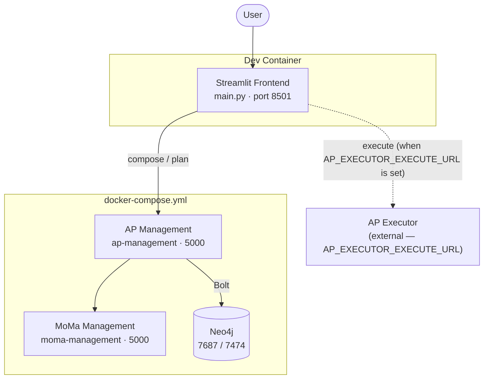

# Analytical Pattern Explorer

A Streamlit app for exploring **Analytical Patterns (APs)** across four stages:

| Tab | What it does | Service |
|-----|--------------|---------|
| **⚡ Compose** | Wire two APs together into one combined pattern | `ap-management` `POST /api/v1/aps/compose` |
| **📋 Plan** | Turn a natural-language task — optionally constrained to a set of datasets, optionally allowing the magic operator — into a wired AP + suggested instantiation parameters | `ap-management` `POST /api/v1/aps/plan` |
| **▶️ Execute** | Run an AP *instance* (`{ap, state}`) — from a preset or pasted/edited by hand — and show per-operator results on the graph | `ap-executor` `POST …/aps/execute` |
| **📋▶️ Plan + Execute** | Plan a task, seed `state` from its suggested parameters, and execute the result in one step | `ap-management` `/plan` → `ap-executor` `…/aps/execute` |

Every AP is rendered as a Graphviz graph; in the Execute tabs, operator nodes are
recoloured by execution status.

The **Execute** and **Plan + Execute** tabs are disabled unless
`AP_EXECUTOR_EXECUTE_URL` points at a reachable executor (see below).

---

## Architecture



**Plan — datasets and the magic operator** (ap-management ≥ v1.9.0):

- **Datasets.** The Plan and Plan + Execute tabs offer every dataset descriptor in
  `assets/datasets/` (PG-JSON, seeded into moma-management at startup under its
  `sc:Dataset` root id). The picked ones are sent as `dataset_ids`. The planner
  derives each dataset's *kinds* from its node labels and only keeps APs whose
  operators can run on them — e.g. SQL operators need a `RelationalDatabase` /
  `Table` / `CSV`, so a SQL task over the PDF corpus fails with `422`. The shipped
  datasets cover a relational database (*Era5land*), an Excel file (*ISCO
  taxonomy*) and a PDF corpus (*Climate Policy Report Corpus*). In production,
  picking datasets is [cross-dataset-discovery](https://github.com/datagems-eosc/cross-dataset-discovery)'s job.
- **Magic operator.** The *Allow magic operator* toggle sends
  `allow_magic_operator: true`: a step no catalogued AP covers — or the whole task —
  becomes a generic LLM-backed `Magic_Operator` (purple in the graph), whose
  generated `instruction` is returned as an instantiation parameter.

**Known limitations** (upstream, not in this demo):

- A planned AP is only *type*-compatible with its datasets: it holds no dataset
  nodes, and the dataset descriptors carry no credentials, so connection
  parameters (e.g. Text-to-SQL's `parameters.db_info`) can't be suggested.
  Plan + Execute therefore can't run a dataset-backed plan end to end.
- Magic-operator plans don't execute yet: the planner names the payload input
  dynamically, whereas the deployed magic operator only accepts the inputs its
  config declares, and ap-executor drops undeclared inputs.

**Execute:**

The **Execute** and **Plan + Execute** tabs POST an AP instance (`{ap, state}`)
to an [AP Executor](https://github.com/SoTrx/ap-executor), which resolves each
operator to a microservice via Consul and orchestrates the run with Dapr
Workflow. There is no in-app fallback: both tabs disable their run button, with a
notice, until `AP_EXECUTOR_EXECUTE_URL` is set to a reachable executor (see
below). `Execute` runs the instance you load/paste as-is; `Plan + Execute` first
calls `/plan`, seeds `state` from the returned suggested parameters, and executes
the result.

The HTTP clients under `generated/` are auto-generated with
[Kiota](https://github.com/microsoft/kiota) from each service's OpenAPI spec.

---

## Running the demo

### 1. Authenticate with GitHub Container Registry

Sidecar images are on GHCR. Create a [GitHub PAT](https://github.com/settings/tokens)
with the `read:packages` scope, then:

```sh
echo YOUR_GITHUB_PAT | docker login ghcr.io -u YOUR_GITHUB_USERNAME --password-stdin
```

### 2. Open in the dev container

Open the repo in VS Code → **Reopen in Container**. This starts the base sidecars
(Neo4j, MoMa Management, AP Management) via `docker-compose.yml`.

### 3. Run the app

```sh
streamlit run main.py
```

The **Compose** and **Plan** tabs work with just the base stack. **Execute** and
**Plan + Execute** stay disabled until you point at an executor (next step).

### 4. Enable execution

Bring up an [`ap-executor`](https://github.com/SoTrx/ap-executor) instance
however you like (its repo ships a self-contained e2e stack), then set the full
execute-endpoint URL — gateway path prefix and all:

```sh
export AP_EXECUTOR_EXECUTE_URL=http://datagems.127.0.0.1.sslip.io:8080/moma2/v1/api/aps/execute
streamlit run main.py
```

For a plain executor on the stock route, `export AP_EXECUTOR_SERVICE_URL=http://your-ap-executor:5000`
also sets `AP_EXECUTOR_EXECUTE_URL` to `…/api/v1/aps/execute` — but the tabs
check `AP_EXECUTOR_EXECUTE_URL` specifically, so set that one to be sure.

The **Execute** tab ships one preset — *text to sql + explain on mathe*, a
Text-to-SQL → ProvSQL instance in `presets/execute_presets.json` — and you can
paste/edit any instance by hand. **Plan + Execute** offers the same preset as a
natural-language task.

---

## Regenerating the API clients

```sh
make clients
```

- The `moma-management` client is generated from the live service's
  `/openapi.json` (needs the base stack up).
- The `ap-management` and `ap-executor` clients are generated from the vendored
  specs `openapi/ap_management.json` (ap-management v1.9.0) and
  `openapi/ap_executor.json`, so they don't depend on which image is running.
  Refresh them from running services with:

  ```sh
  curl -s http://ap-management:5000/openapi.json > openapi/ap_management.json
  curl -s http://ap-executor:5000/openapi.json > openapi/ap_executor.json
  ```
